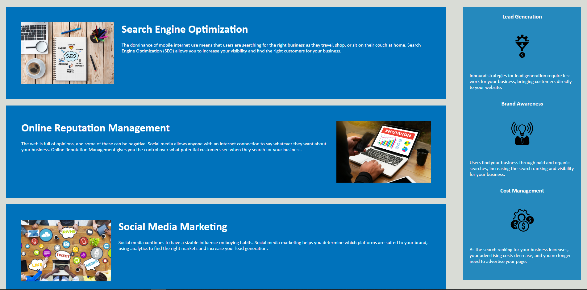

# code-refactor

## Description

This reason for this project was to clean up the html and css code, by adding semantic HTML elements, make sure the elements follow logical structure, add acessible alt attributes, make sure the heading attributes were in sequential order, and add a descriptive title. The reason for this project was to take what was learned about basic HTML and css elements and implement them in some already given code. This project was solved by condensing repetitive css code and change html elements to better understand how they work. The biggest thing i learned is if you have multiple class elements that have the same css rules you can combine them all to get the same rules by seperating the elemtents with a ",".

## Screenshots

## Link to deployed application.
[code-refactor](https://amassey42.github.io/code-refactor/)
